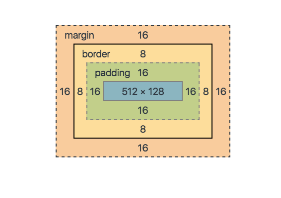

# 실전 웹퍼블리싱

## HTML, 이건 꼭 알고가자
### DOCTYPE
- 문서 형식을 나타낸다. 이 문서는 html 문서이다.
```html
<!DOCTYPE html>
<html>
  <head>
    <meta charset="utf-8">
    <title>My test page</title>
    <link rel="stylesheet" href="/css/style.css">
  </head>
  <body>
    <p>This is my page</p>
    <script src="/js/common.js"></script>
  </body>
</html>
```

### HTML TAG list
- meta > 서버와 브라우저 간의 정보 정의
```html
<!-- 검색 엔진에 의해 검색되는 단어 지정 -->
<meta name="Keywords" content="Web, html" />
<!-- 검색 결과에 표시되는 문자 지정 -->
<meta name="Description" content="web과 html을 공부합니다." />
...
<!-- https://webclub.tistory.com/354 -->
```
- header > 헤더(네비게이션이나 페이지에 대한 정보(로고 등))
```HTML
<header>
    <h1>LOGO</h1>
    <nav>
        <ul>
            <li><a href="#">메뉴1</a></li>
            <li><a href="#">메뉴2</a></li>
            <li><a href="#">메뉴3</a></li>
            <li><a href="#">메뉴4</a></li>
        </ul>
    </nav>
</header>
```
- main > 문서의 주요 콘텐츠 (페이지 당 1번 사용)
```HTML
<!-- IE에서 지원하지 않기때문에 ARIA role을 추가 -->
<main role="main">
    <p>문서의 주요한 내용</p>
</main>
```
- footer > 푸터
```HTML
<footer>
    <strong></strong>
    <p>copyright...</p>
</footer>
```
- nav > 메뉴, 네비게이션
```HTML
<nav>
    <ul>
        <li><a href="#">메뉴1</a></li>
        <li><a href="#">메뉴2</a></li>
        <li><a href="#">메뉴3</a></li>
        <li><a href="#">메뉴4</a></li>
    </ul>
</nav>
```
- article > 내용이 각기 독립적이며, 홀로 사용할 수 있는 내용
```HTML
<!-- 주로 블로그, 포럼, 뉴스 기사 등에 사용 -->
<article>
    <h1>홍콩공항 운영 재개...아침 8시쯤 첫 이륙</h1>
    <p>
        현재 공항 내 항공기 출발과 도착을 안내하는 게시판에는 다수의 항공기가 '곧 탑승'을 시작한다는 메시지가 올라와 있습니다.
    </p>
</article>
```
- section > 서로 관계 있는 문서를 분리하는 역할 (문서를 다른 주제로 구분 짓기 위해 사용)
```HTML
<!-- 내용이 서로 관계가 있다면 section으로 구분 -->
<section>
    <h1>HTML</h1>
    <p>Hyper Text Markup Language</p>
</section>
<section>
    <h1>CSS</h1>
    <p>Cascading Style Sheet</p>
</section>
```
- aside > 주 내용과 연관이 있으나 필수가 아닌 경우
```HTML
<header>HTML</header>
<!-- article내부에 존재할 경우 연관이 있는 내용 -->
<article>
    <h1>article</h1>
    <p>article is ...</p>
    <aside>
        <a href="#">article태그 실습</a>
    </aside>
</article>
<!-- article내부에 존재할 경우 전체 페이지와 연관이 있는 내용 -->
<aside>
    <a href="#">HTML태그 목록</a>
</aside>

```
- ul li > 순서없는 목록
```HTML
<ul>
    <li>수박</li>
    <li>참외</li>
    <li>사과</li>
    <li>메론</li>
</ul>
```
- ol li > 순서있는 목록
```HTML
<ol>
    <li>회원가입 버튼 클릭</li>
    <li>정보 입력</li>
    <li>완료</li>
    <li>로그인</li>
    <li>서비스 이용</li>
</ol>
```
- dl dt dd > 정의형 목록
```HTML
<dl>
    <dt>HTML</dt>
    <dd>Hyper Text Markup Language</dd>
    <dt>CSS</dt>
    <dd>Cascading Style Sheet</dd>
</dl>
```
- p > 문단, 문장
```HTML
<p>내가 다니는 학교는 ㅇㅇ고등학교 입니다.</p>
```
- br > 줄바꿈
```HTML
<p>내가 다니는 학교는<br>ㅇㅇ고등학교 입니다.</p>
```
- div > 의미없는 블럭
```HTML
<div>
    <p>내가 다니는 학교는 ㅇㅇ고등학교 입니다.</p>
</div>
```
- span > 의미없는 태그
```HTML
<p>내가 다니는 학교는 <span>ㅇㅇ고등학교</span>입니다.</p>
```
- strong > 강조
```HTML
<p>내가 다니는 학교는 <strong>ㅇㅇ고등학교</strong>입니다.</p>
```
- em > 강조
```HTML
<p>내가 다니는 학교는 <em>ㅇㅇ고등학교</em>입니다.</p>
```
- a > 링크
```HTML
<a href="page.html">페이지이동</a>
```
- figure figcaption > 이미지나 차트 등을 설명하는 문구
```HTML
<figure>
    
    <figcaption>나무에 걸려있는 바나나 (사진:작가)</figcaption>
</figure>
```

### 작성 시 주의할 내용
- 스크립트는 페이지 최하단에 위치하도록 (로드포함)
- id는 중복사용불가, class는 중복사용 가능, 때문에 스타일을 위한 id사용은 지양
- 코드블럭별 들여쓰기 (가독성)
- inline 스타일 작성은 지양

---
## CSS, 이건 꼭 알고가자
- 대부분의 속성이 실제로 사용됨

### 레이아웃 필수
- block, inline
- box model
  - 
- position (fixed, relative, absolute)
- float (zoom)
```HTML
<ul>
    <li><a href="#">메뉴 1</a></li>
    <li><a href="#">메뉴 2</a></li>
    <li><a href="#">메뉴 3</a></li>
    <li><a href="#">메뉴 4</a></li>
</ul>
```
```CSS
ul {zoom:1;}
ul:after {display:block; content:""; clear:both;}
ul li {float:left;}
```
- flex(*)
```HTML
<ul>
    <li><a href="#">메뉴 1</a></li>
    <li><a href="#">메뉴 2</a></li>
    <li><a href="#">메뉴 3</a></li>
    <li><a href="#">메뉴 4</a></li>
</ul>
```
```CSS
ul {display:flex;}
ul li {flex-direction:row;}
```
- 가상클래스 
```CSS
::after, ::before, :nth-child, :first-child, :last-child
```
- vendor prefix
```CSS
.elem {
    -moz-box-shadow:2px 2px 2px #000;
    -webkit-box-shadow:2px 2px 2px #000;
    -o-box-shadow:2px 2px 2px #000;
    -ms-box-shadow:2px 2px 2px #000;
    box-shadow:2px 2px 2px #000;
}
```
- 세로정렬 layout
```CSS
(absolute 50%, margin-top), (absolute 50%, transform:translate), (table-cell, vertical-align:middle)
```
- 미디어쿼리
```html
<!-- html파일 내 조건 css로드(768px 이하일때 해당 css로드) -->
<link rel="stylesheet" media="screen and (max-width: 768px)" href="mobile-style.css" />
```
```CSS
/*css내부 작성 (768px 이하일때 스타일 적용)*/
@media screen and (max-width: 768px) {color:... }
```
---
## 자바스크립트, 이건 꼭 알고가자

### UI개발 필수
- 변수
```javascript
var name = 'bk';
var num = 1;
var is = true;
```
- 함수
```javascript
function plus(){
    return 1 + 1;
}
```
- 배열
```javascript
var arr = [1, 'bk', plus()];
arr[1];
```
- 객체
```javascript
var obj = {
    name: 'bk',
    age: 22,
    fnc: function(){
        return 1 + 1;
    },
}
obj.name;
obj.fnc();
```
- loop (반복)
```javascript
for(var i; i < 5; i++){
    alert(i);
}
```
- if (조건)
```javascript
if(true){
    alert(true);
}
```
- scope (범위)
```javascript
//전역변수 (global var)
var i = 0;
function scope(){
    //지역변수 (local var)
    var i = 1;
}
scope();
alert(i);
```
- DOM선택
```html
<!-- HTML -->
<button id="button"></button>
```
```javascript
//Javascript
var $button = document.getElementById('button');

//jQuery
var $button = $('#button');
```
...

### 플러그인, 라이브러리 사용 (응용)
- 플러그인 (컴포넌트) modal, slider...
- 라이브러리 (비슷한 성격을 가진 컴포넌트들의 집합체) jQuery..
- 웹에서 자주 쓰이는 플러그인 > swiperjs ...
- 샘플 가져와서 사용하기

---
## 유용한 사이트 
- 테스트 코드 작성(샘플) > https://www.jsfiddle.net
- 웹사이트 트렌드 CSSDA > https://www.cssdesignawards.com/
- 브라우저 지원여부 CAN I USE > https://caniuse.com/
- HTML 검수 W3C > http://validator.w3.org/#validate_by_input+with_options
- CSS 검수 W3C > http://jigsaw.w3.org/css-validator/


---
## 레이아웃 실습

### 실전 레이아웃
- 다단 반응형 레이아웃 (/sample/layout_responsive.html)
- 

### 레이아웃 실습
#### PC - 도미노피자 (https://web.dominos.co.kr/main?locale=ko)

#### Responsive - STUDIO-JT (https://studio-jt.co.kr/)

---
## 진행 일정 (예상)
1. ~~2019/08/17 : 기초 설명 (html, css, javascript 이론) > 과제 (PC실습 도미노피자)~~  
2. ~~2019/08/25 : 과제 리뷰, 설명(jquery 이벤트), 실습 > tab 콘텐츠, > 과제 (PC실습 도미노피자 마무리)~~
    - ~~이벤트 : 클릭, resize, scroll, load ...~~
3. ~~2019/09/01 : 과제 리뷰(슬라이더), 실습 > 아코디언(FAQ), 레이어팝업~~
4. ~~2019/09/08 : 과제 리뷰, 실습 > 아코디언(FAQ), 레이어팝업, 스크롤 위치에 따른 header 걸치기, UI 반응형 웹 레이아웃 만들기 실습 (sample)~~
5. studio-jt 메인 작업 (비율 유지하는 이미지(item) 박스)
6. studio-jt 메인 작업 (header)
7. studio-jt 서브 작업
8. studio-jt 서브 작업
...


### 웹 UI만들기 실습 목록
1. ~~tab 콘텐츠 : 2019/08/25~~
2. 아코디언(FAQ)
3. 레이어팝업
4. 스크롤 위치에 따른 header 걸치기 UI
5. 스르륵나오는 메뉴
6. 이미지슬라이더 (swiperjs)
7. GNB
8. 마우스 오버시 커지는 이미지목록
9. 비율 유지하는 이미지목록 (css, javascript)


